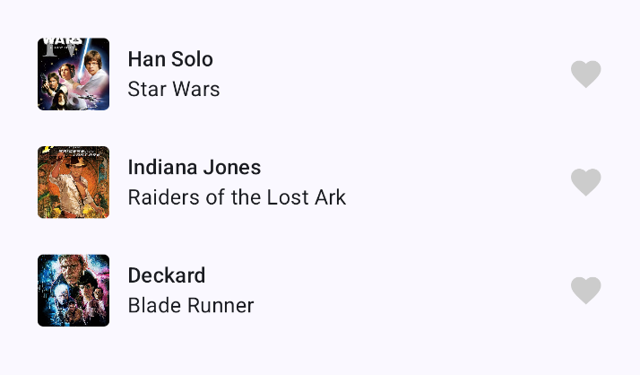

# TalkBack demo

For this demo, we will explore adding screen reader support for TalkBack.

## TalkBack

### Setup TalkBack

- Open settings 
- Navigate to Accessibility > Settings > TalkBack > Settings > Advanced settings > Developer settings
- Enable “Display speech output”
- Navigate back and turn on TalkBack
- TURN DOWN YOUR VOLUME!!!

### How to use TalkBack

- Slide left and right for next / previous item
- Double click to click selection
- Long press to move selection
- Two fingers for dragging / gestures

## Project instructions

Try building and launching the project on your phone, and navigate around with TalkBack. It should have "ok" support for screen readers out of the box, but has several flaws that we can fix.

### 1. ActorHeader composable

#### Actor image

The actor image does not have a content description, and instead has a default description of "Unlabelled, Image".

Add a content description using `R.string.actor_image`

#### Boo button
We have two buttons, one "Cheer" button that's using the Button composable, and a "Boo" button constructed manually using Box and `Modifier.clickable`.

These two behave differently with a screen reader. The "Cheer" button is recognized semantically as a button but the "Boo" button is not.

Try adding the `Role.Button` semantics on the "Boo" button using `Modifier.semantics { role = Role.Button }`

### 2. MovieRoleItem composable

#### Merge items
In the movie role row, each sub-element is navigated individually.

Try merging the elements in the row using `Modifier.semantics (mergeDescendants = true) {}`

#### Heart button
The favorite button has a default description of "Unlabelled, Image".

Change `Modifier.clickable` to `Modifier.toggleable`

Add a `Modifier.semantics` with a stateDescription of `R.string.liked` or `R.string.not_liked` depending on the state.
Also add a role of `Role.Switch` to get switch semantics

### 3. MovieRolesList composable

#### List item semantics
Each list item is navigated individually, but we can add semantics to navigate them as list items in a list. 

In the parent column, add a `Modifier.semantics` with `collectionInfo = CollectionInfo(columnCount = movieRoles.size, rowCount = 1)` to add list semantics.

For each list item, pass down a `Modifier.semantics` with `collectionItemInfo` to the list item composable with the corresponding columnIndex in the list (the rest of the properties can be left as 1)

## More information

[Introduction to Accessibility, Notion](https://www.notion.so/bontouch/Introduction-8ac4603a7ab3446aaf4248db81c4f517?pvs=4)

[Android accessibility ways of working, Notion](https://www.notion.so/bontouch/Android-development-d0368ca145754a099b5605ec2b99b42f?pvs=4)